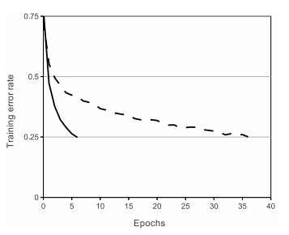
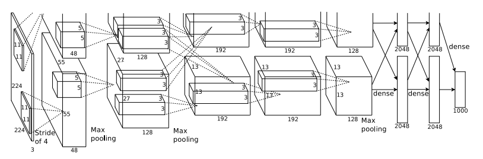

# 논문리뷰(AlexNet)
## 리뷰할 논문  : ImageNet Classification with Deep Convolutional Neural Networks
해당 논문은 레파지토리에 첨부했으니 참고하실 분들은 참고하시면 될 것 같습니다.
  

## 1. Introduction
이전의 이미지 인식 모델은 대부분 ML모델로 수만개 정도의 작은 데이터셋에서 충분한 성능을 발휘해왔다. 하지만 현실의 환경에서는 물체가 상당한 가변성을 가지고 있어 훨씬 더 큰 훈련 데이터를 필요로 했다. 
그러나 수십만개의 이미지로 구성된 ImageNet이 등장합니다. 이러한 데이터를 학습하기 위해서는 학습능력이 높은 모델이 필요로한다.  CNN은 그러한 모델중 하나입니다. feed-forward-network와 비교하여 훨씬 적은 수의 매개변수를 사용하므로 학습에 유리한 면이 있습니다. 
이에 논문은 CNN을 기반으로 하는 Alexnet을 제안하고 있습니다.

## 2. The Dataset
ImageNet은 약 22,000개의 라벨을 가진 1500만 개 이상의 레이블이 지정된 고해상도 이미지의 데이터 세트입니다 
ImageNet은 가변 해상도 이미지로 구성되는 반면, 우리 시스템은 일정한 입력 차원을 요구한다. 따라서, 우리는 이미지를 256 × 256의 고정 해상도로 다운샘플링을 진행했습니다. 그후 추가적인 사전처리는 진행하지 않았으며 RGB값에 대해 네트워크를 훈련했다.

## 3. The Architecture
### 3.1 ReLU Nonlinearity
 경사하강법의 과 더불어 다른 activation 함수에 비해 Relu가 몇배는 빠름을 확인하였고 논문의 모델은 4 convolution-layer로 구성되어 있어 결과적으로 relu를 사용할 경우 6배 빠른 효과를 얻을 수 있다고 말한다. 
  

### 3.2 Training on Multiple GPUs
 GPU를 활용한 training은 리뷰를 진행하는 지금 시점에서 일반적으로 사용되는 부분이기에 이부분을 따로 설명하지는 않겠습니다.
### 3.3 Local Response Normalization
 논문이 발간될 당시에는 batch nomalization에 대한 논문이 발표되기 전이었다.(Batch Normalization에 대한 논문은 2015년 발간, AlexNet은 2012년 발간) 
  그래서 해당 논문에서는 Relu가 가지는 문제점 중 하나인 양수에서 출력신호가 강하게 발생할 수 있는 부분에 대해서 인접 필터와의 정규화를 통해 해소하려고 하고 있고 해당 방법을 사용시 Top-1/Top-5에서 error rate가 각각 1.4%, 1.2% 개선의 효과가 나왔음을 이야기하고 있다. 현재는 batch nomalization이 일반화된 방식이므로 구현에서는 batch nomalization을 사용하여 구현을 진행하겠다.
### 3.4 Overlapping Pooling
해당 논문 이전에는 pooling을 진행할 경우 영역이 겹치지 않는것이 일반적이었으나 구간을 겹치면서 pooling을 할경우 Top-1/Top-5에서 error rate가 각각 0.4%, 0.3% 감소함을 확인했다.
### 3.5 Overall Architecture
 
 - input_shape : (224, 224, 3)
 - conv1 : kernel_size = (11, 11), stride = 4
 - maxpooling1 : kernel_size = (3, 3), stride = 2
 - conv2 : kernel_size = (5, 5), stride = 4
 - maxpooling2 : kernel_size = (3, 3), stride = 2
 - conv3 : kernel_size = (3, 3), stride = 4
 - conv4 : kernel_size = (3, 3), stride = 4
 - conv5 : kernel_size = (3, 3), stride = 4
 - maxpooling4 : kernel_size = (3, 3), stride = 2
 - fully-connected layers : 4096
 - fully-connected layers : 4096
 - fully-connected layers : 1000
 

## 4 Reducing Overfitting
### 4.1 Data Augmentation
### 4.2 Dropout
## 5 Details of learning