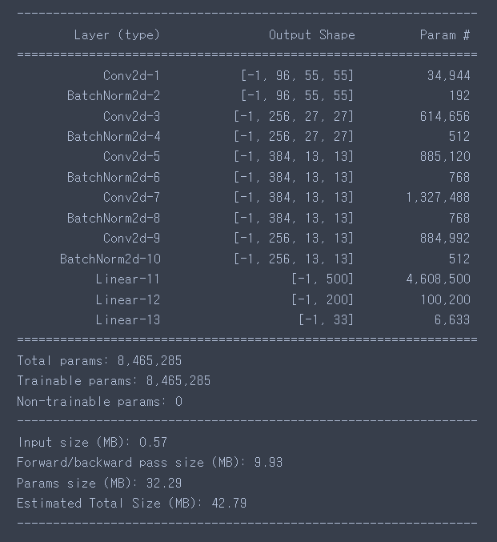
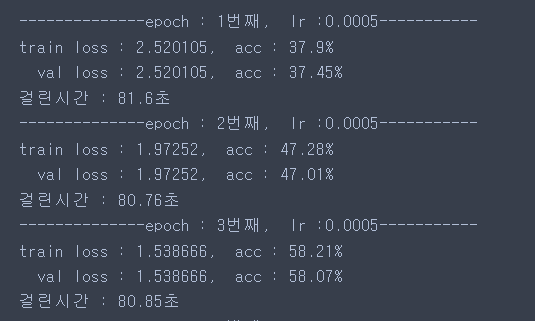
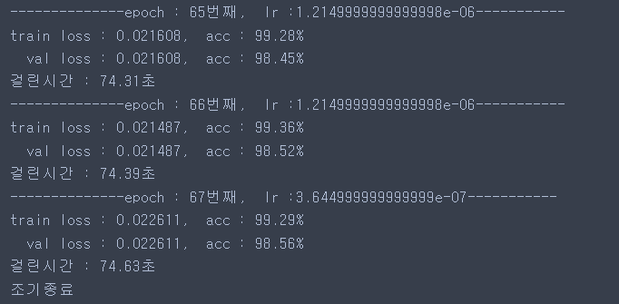

# 논문리뷰(AlexNet)
## 리뷰할 논문 <br>: ImageNet Classification with Deep Convolutional Neural Networks
논문의 내용을 활요하여 실습해볼 내용은 식물의 잎 이미지를 통해 해당 식물의 질병 여부를 판별해보는 프로젝트를 진행할 것이다.
<br><br>

## 1. The Dataset

데이터셋 원본 주소<br>
https://data.mendeley.com/datasets/tywbtsjrjv/1<br>
위의 데이터에서 분류를 위해 건강한 잎의 데이터만 있는 데이터는 제외하고 총 33가지 케이스의 분류를 진행했다.

## 2. The Architecture
### 논문과 다른 부분
### 1 Batch Normalization
 해당 논문에서는 relu가 가지는 양수에서의 출력신호가 강하게 발생할 수 있는 부분을 제어하기 위해 인접필터와의 정규화를 통해 해소 하였다. 하지만 해당 방식은 이후 batch nomalization으로 많은 부분 대체가 가능하기에 해당 프로젝트에서는 batch nomalization을 활용하여 해당 방식을 대체한다. <br>

### 2 Architecture
```python
class alexnet(nn.Module):
    def __init__(self):
        super(alexnet, self).__init__()
        
        self.conv1 = nn.Conv2d(in_channels=3, out_channels=96, kernel_size=11, stride=4, padding=2)
        self.bn1 = nn.BatchNorm2d(num_features=96)
        self.conv2 = nn.Conv2d(in_channels=96, out_channels=256, kernel_size=5, stride=1, padding=2)
        self.bn2 = nn.BatchNorm2d(num_features=256)
        self.conv3 = nn.Conv2d(in_channels=256, out_channels=384, kernel_size=3, stride=1, padding=1)
        self.bn3 = nn.BatchNorm2d(num_features=384)
        self.conv4 = nn.Conv2d(in_channels=384, out_channels=384, kernel_size=3, stride=1, padding=1)
        self.bn4 = nn.BatchNorm2d(num_features=384)
        self.conv5 = nn.Conv2d(in_channels=384, out_channels=256, kernel_size=3, stride=1, padding=1)
        self.bn5 = nn.BatchNorm2d(num_features=256)
        
        self.fc1 = nn.Linear(in_features=256*6*6, out_features=500)
        self.fc2 = nn.Linear(in_features=500, out_features=200)
        self.fc3 = nn.Linear(in_features=200, out_features=33)
        
    def forward(self, x):
        # 1 layer
        x = self.conv1(x)
        x = self.bn1(x)
        x = F.relu(x)
        x = F.max_pool2d(x, kernel_size=3, stride=2)

        # 2 layer
        x = self.conv2(x)
        x = self.bn2(x)
        x = F.relu(x)
        x = F.max_pool2d(x, kernel_size=3, stride=2)
        
        # 3 layer
        x = self.conv3(x)
        x = self.bn3(x)
        x = F.relu(x)
        
        # 4 layer
        x = self.conv4(x)
        x = self.bn4(x)
        x = F.relu(x)
        
        # 5 layer
        x = self.conv5(x)
        x = self.bn5(x)
        x = F.relu(x)
        x = F.max_pool2d(x, kernel_size=3, stride=2)

        x = x.view(x.size(0), -1)

        # 6 layer
        x = self.fc1(x)
        x = F.relu(x)
        x = F.dropout(x, p=0.5)

        # 7 layer
        x = F.relu(self.fc2(x))
        x = F.dropout(x, p=0.5)
        
        x = F.relu(self.fc3(x))
        x = F.log_softmax(x, dim=1)
        
        return x
    
```
<br>
 


## 3 Reducing Overfitting
### 1 Data Augmentation
 논문과 유사하게 50% 확률로 수평반전, 수직반전, padding을 추가하여 224*224로 자르는 방식을 진행하여 과적합을 방지하였다.
```python
cfg = {
    'image_size' : 235,
    'epochs' : 200,
    'lr' : 0.5e-3,
    'batch_size' : 128,
    'seed' :2023
}

np.random.seed(cfg['seed'])
torch.manual_seed(cfg['seed'])
torch.cuda.manual_seed_all(cfg['seed'])

data_transforms = {
    'train' : transforms.Compose([
        transforms.Resize([cfg['image_size'],cfg['image_size']]),
        transforms.RandomHorizontalFlip(),
        transforms.RandomVerticalFlip(),
        transforms.RandomCrop(224,padding=4),
        transforms.ToTensor()
    ]),
    'val' : transforms.Compose([
        transforms.Resize([cfg['image_size'],cfg['image_size']]),
        transforms.RandomCrop(224),
        transforms.ToTensor()
    ])
}
```
## 4 Details of learning
 - Batch-size = 128
 - Adam - learning-rate 0.0005, 4회이상 개선이 없을 경우 현재 * 0.3<br>


## 6. Results
<br>
<br>

